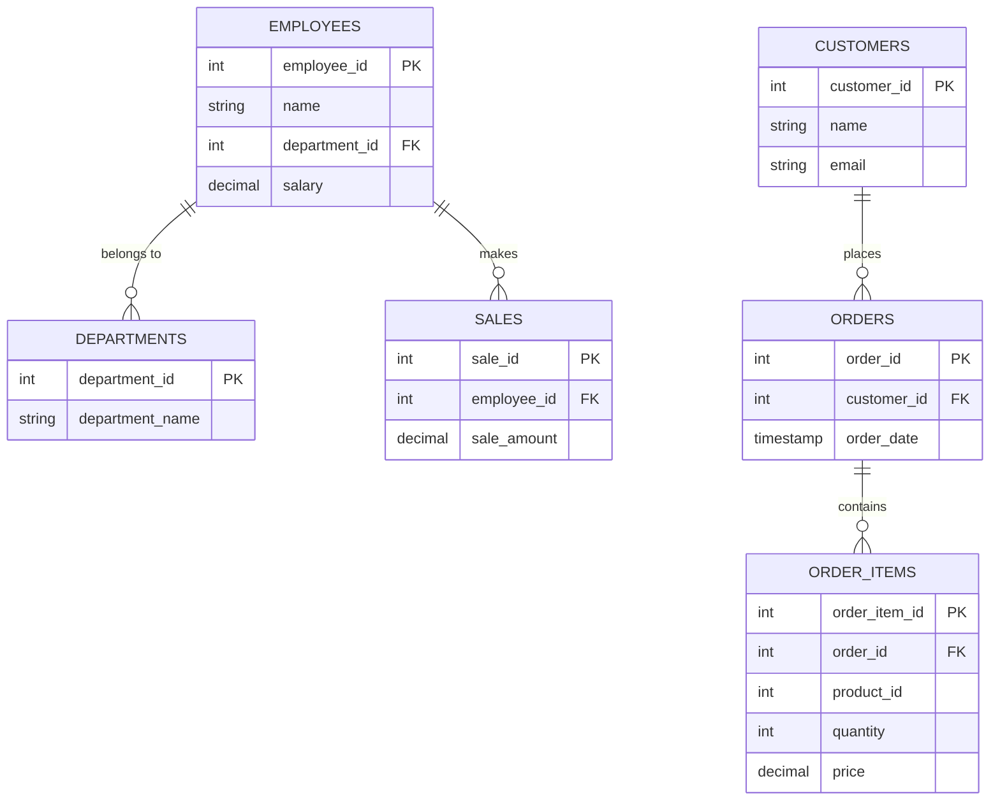

# Joins Database

## Overview
This document provides an overview of the `joins_db` database schema, including its tables, relationships, and commonly used SQL queries for SQL joins.

## Database Schema
The `joins_db` database consists of multiple tables managing employees, sales, products, orders, customers, and user logins.

## Database Relationships

