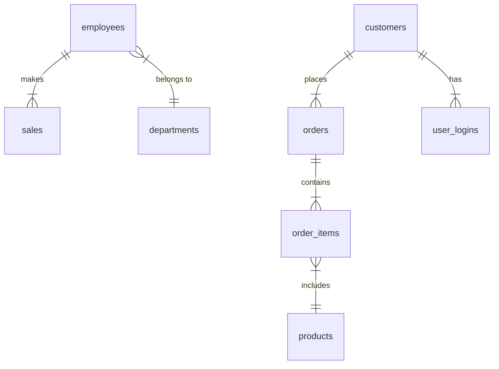

# Business Operations Database

## Overview
This document provides an overview of the `business_ops_db` database schema, including its tables, relationships, and commonly used SQL queries for analysis and reporting.

## Database Schema
The `business_ops_db` database consists of multiple tables managing employees, sales, products, orders, customers, and user logins.

## Tables

### **1. employees**
Stores employee details.
- `employee_id` (Primary Key)
- `name`
- `department_id`
- `salary`
- `hire_date`

### **2. sales**
Records sales transactions.
- `sale_id` (Primary Key)
- `employee_id` (Foreign Key -> employees.employee_id)
- `sale_amount`
- `sale_date`

### **3. departments**
Stores department details.
- `department_id` (Primary Key)
- `department_name`

### **4. products**
Contains product information.
- `product_id` (Primary Key)
- `product_name`
- `category`

### **5. orders**
Stores customer orders.
- `order_id` (Primary Key)
- `customer_id`
- `order_date`

### **6. order_items**
Represents items in an order.
- `order_item_id` (Primary Key)
- `order_id` (Foreign Key -> orders.order_id)
- `product_id` (Foreign Key -> products.product_id)
- `quantity`
- `price`

### **7. customers**
Stores customer details.
- `customer_id` (Primary Key)
- `name`
- `email`
- `registration_date`

### **8. user_logins**
Tracks customer login activity.
- `login_id` (Primary Key)
- `user_id` (Foreign Key -> customers.customer_id)
- `login_date`

## Database Relationships

## SQL Questions

Medium Level:

1 Write a query to find the second highest salary in an employee table.
2 Fetch all employees whose names contain the letter "a" exactly twice.
3 How do you retrieve only duplicate records from a table?
4 Write a query to calculate the running total of sales by date.
5 Find employees who earn more than the average salary in their department.
6 Write a query to find the most frequently occurring value in a column.
7 Fetch records where the date is within the last 7 days from today.
8 Write a query to count how many employees share the same salary.
9 How do you fetch the top 3 records for each group in a table?
10 Retrieve products that were never sold (hint: use LEFT JOIN).

Challenging Level:

1 Retrieve customers who made their first purchase in the last 6 months.
2 How do you pivot a table to convert rows into columns?
3 Write a query to calculate the percentage change in sales month-over-month.
4 Find the median salary of employees in a table.
5 Fetch all users who logged in consecutively for 3 days or more.
6 Write a query to delete duplicate rows while keeping one occurrence.
7 Create a query to calculate the ratio of sales between two categories.
8 How would you implement a recursive query to generate a hierarchical structure?
9 Write a query to find gaps in sequential numbering within a table.
10 Split a comma-separated string into individual rows using SQL.

Advanced Problem-Solving:

1 Rank products by sales in descending order for each region.
2 Fetch all employees whose salaries fall within the top 10% of their department.
3 Identify orders placed during business hours (e.g., 9 AM to 6 PM).
4 Write a query to get the count of users active on both weekdays and weekends.
5 Retrieve customers who made purchases across at least three different categories