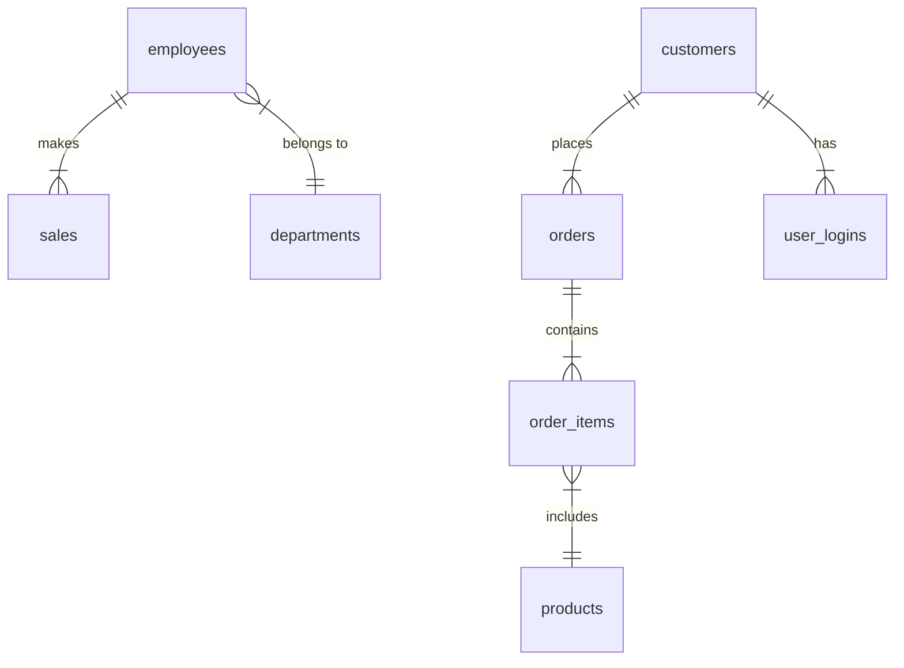

# Business Operations Database

## Overview
This document provides an overview of the `business_ops_db` database schema, including its tables, relationships, and commonly used SQL queries for analysis and reporting.

## Database Schema
The `business_ops_db` database consists of multiple tables managing employees, sales, products, orders, customers, and user logins.

## Tables

### **1. employees**
Stores employee details.
- `employee_id` (Primary Key)
- `name`
- `department_id`
- `salary`
- `hire_date`

### **2. sales**
Records sales transactions.
- `sale_id` (Primary Key)
- `employee_id` (Foreign Key -> employees.employee_id)
- `sale_amount`
- `sale_date`

### **3. departments**
Stores department details.
- `department_id` (Primary Key)
- `department_name`

### **4. products**
Contains product information.
- `product_id` (Primary Key)
- `product_name`
- `category`

### **5. orders**
Stores customer orders.
- `order_id` (Primary Key)
- `customer_id`
- `order_date`

### **6. order_items**
Represents items in an order.
- `order_item_id` (Primary Key)
- `order_id` (Foreign Key -> orders.order_id)
- `product_id` (Foreign Key -> products.product_id)
- `quantity`
- `price`

### **7. customers**
Stores customer details.
- `customer_id` (Primary Key)
- `name`
- `email`
- `registration_date`

### **8. user_logins**
Tracks customer login activity.
- `login_id` (Primary Key)
- `user_id` (Foreign Key -> customers.customer_id)
- `login_date`

## Database Relationships


## SQL Queries

### **Medium Level Queries**
1. Find the second highest salary in an employee table.
```sql
SELECT DISTINCT salary FROM employees ORDER BY salary DESC LIMIT 1 OFFSET 1;
```

2. Fetch all employees whose names contain the letter "a" exactly twice.
```sql
SELECT * FROM employees WHERE name ~* '^([^a]*a[^a]*){2}[^a]*$';
```

3. Retrieve only duplicate records from a table.
```sql
SELECT name, COUNT(*) FROM employees GROUP BY name HAVING COUNT(*) > 1;
```

4. Calculate the running total of sales by date.
```sql
SELECT sale_date, sale_amount, SUM(sale_amount) OVER (ORDER BY sale_date) AS running_total FROM sales;
```

5. Find employees who earn more than the average salary in their department.
```sql
SELECT e.* FROM employees e
JOIN (
    SELECT department_id, AVG(salary) AS avg_salary
    FROM employees GROUP BY department_id
) dept_avg ON e.department_id = dept_avg.department_id
WHERE e.salary > dept_avg.avg_salary;
```

### **Challenging Queries**
1. Retrieve customers who made their first purchase in the last 6 months.
```sql
SELECT c.* FROM customers c
JOIN orders o ON c.customer_id = o.customer_id
WHERE o.order_date >= CURRENT_DATE - INTERVAL '6 months'
ORDER BY o.order_date ASC;
```

2. Calculate the percentage change in sales month-over-month.
```sql
SELECT sale_date, sale_amount,
  (sale_amount - LAG(sale_amount) OVER (ORDER BY sale_date)) / LAG(sale_amount) OVER (ORDER BY sale_date) * 100 AS percent_change
FROM sales;
```

3. Fetch all users who logged in consecutively for 3 days or more.
```sql
SELECT user_id FROM (
    SELECT user_id, login_date,
           LEAD(login_date, 1) OVER (PARTITION BY user_id ORDER BY login_date) AS next_login,
           LEAD(login_date, 2) OVER (PARTITION BY user_id ORDER BY login_date) AS third_login
    FROM user_logins
) consecutive
WHERE next_login = login_date + INTERVAL '1 day'
AND third_login = login_date + INTERVAL '2 days';
```

### **Advanced Queries**
1. Fetch all employees whose salaries fall within the top 10% of their department.
```sql
SELECT * FROM employees e
WHERE salary >= (
    SELECT PERCENTILE_CONT(0.9) WITHIN GROUP (ORDER BY salary) FROM employees e2
    WHERE e.department_id = e2.department_id
);
```

2. Identify orders placed during business hours (9 AM to 6 PM).
```sql
SELECT * FROM orders WHERE EXTRACT(HOUR FROM order_date) BETWEEN 9 AND 18;
```

3. Retrieve customers who made purchases across at least three different categories.
```sql
SELECT c.customer_id, c.name FROM customers c
JOIN orders o ON c.customer_id = o.customer_id
JOIN order_items oi ON o.order_id = oi.order_id
JOIN products p ON oi.product_id = p.product_id
GROUP BY c.customer_id, c.name
HAVING COUNT(DISTINCT p.category) >= 3;
```

---
## Conclusion
This document serves as a reference for database design, entity relationships, and common SQL queries. It covers employee management, sales tracking, product orders, and customer interactions.

Let me know if you need any modifications or additional queries! 🚀