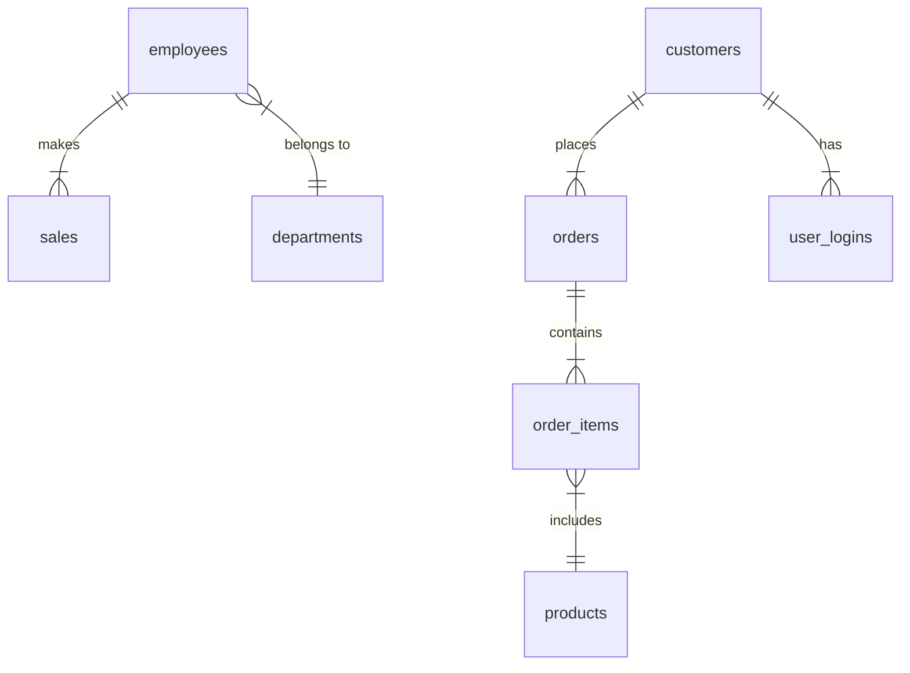

# Business Operations Database

## Overview
This document provides an overview of the `business_ops_db` database schema, including its tables, relationships, and commonly used SQL queries for analysis and reporting.

## Database Schema
The `business_ops_db` database consists of multiple tables managing employees, sales, products, orders, customers, and user logins.

## Tables

### **1. employees**
Stores employee details.
- `employee_id` (Primary Key)
- `name`
- `department_id`
- `salary`
- `hire_date`

### **2. sales**
Records sales transactions.
- `sale_id` (Primary Key)
- `employee_id` (Foreign Key -> employees.employee_id)
- `sale_amount`
- `sale_date`

### **3. departments**
Stores department details.
- `department_id` (Primary Key)
- `department_name`

### **4. products**
Contains product information.
- `product_id` (Primary Key)
- `product_name`
- `category`

### **5. orders**
Stores customer orders.
- `order_id` (Primary Key)
- `customer_id`
- `order_date`

### **6. order_items**
Represents items in an order.
- `order_item_id` (Primary Key)
- `order_id` (Foreign Key -> orders.order_id)
- `product_id` (Foreign Key -> products.product_id)
- `quantity`
- `price`

### **7. customers**
Stores customer details.
- `customer_id` (Primary Key)
- `name`
- `email`
- `registration_date`

### **8. user_logins**
Tracks customer login activity.
- `login_id` (Primary Key)
- `user_id` (Foreign Key -> customers.customer_id)
- `login_date`

## Database Relationships

